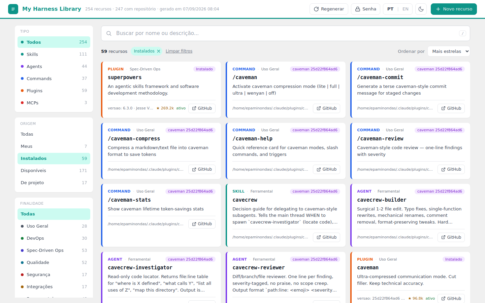

# My Harness Library

**A self-hosted, searchable inventory of everything your Claude Code installation can actually do — with an in-browser Markdown editor for the resources you own.**

Claude Code accumulates capability fast. You install a plugin and get thirty skills you never see listed. You write a skill for one project and forget it exists. `~/.claude` becomes a place you *have*, not a place you *know*.

My Harness Library scans that tree — plus every installed plugin and every project-local `.claude/` — and publishes a single static page: every skill, agent, command, plugin and MCP server, each classified by purpose, each linked to the GitHub repository it came from, all searchable in one box.

On a typical installation the difference is stark: the Claude Code plugin list shows **58 plugins**; My Harness Library shows the **248 individual resources** inside them — and tells you which **52** are actually installed and loadable, versus the **183** that merely sit in a marketplace catalogue waiting to be installed.

---

## Table of contents

- [What it does](#what-it-does)
- [Screenshot tour](#screenshot-tour)
- [Requirements](#requirements)
- [Installation](#installation)
- [First run: the initial password](#first-run-the-initial-password)
- [How it works](#how-it-works)
- [Security model](#security-model)
- [Configuration](#configuration)
- [Command reference](#command-reference)
- [Updating](#updating)
- [Uninstalling](#uninstalling)
- [Troubleshooting](#troubleshooting)
- [Project layout](#project-layout)
- [Notes for contributors](#notes-for-contributors)
- [License](#license)

---

## What it does

### Discovers everything, not just the top level

Five sources are scanned:

| Source | What is found |
|---|---|
| `~/.claude/skills`, `/agents`, `/commands` | the resources you wrote yourself |
| `~/.claude/plugins/**` | every skill, agent and command *inside* each plugin |
| `~/.claude.json` | MCP servers, global and per-project |
| plugin manifests | the plugin packages themselves |
| `<project>/.claude/**` | skills versioned inside your repositories |

### Separates what is installed from what is merely available

`~/.claude/plugins` holds two very different things in one tree: `marketplaces/`
is a *catalogue* of everything you could install, while `cache/` holds the copies
that actually are — one directory per version ever downloaded.

Walking that tree naively conflates the two and counts the same skill several
times: once from the catalogue, once per cached version. `installed_plugins.json`
records exactly which path is active, so that is what decides.

Every resource is therefore tagged by origin — **Mine**, **Installed**,
**Available**, **From project** — and the installed copy always wins when the
same resource appears in both places. Catalogue entries are dimmed, because they
are not loaded by anything yet.

The distinction matters beyond bookkeeping: installed plugin resources are
overwritten on the next marketplace update, and project resources live in git.

### Classifies by purpose

Every resource gets a category badge: **General**, **DevOps**, **Spec-Driven Ops**, **Quality**, **Security**, **Integrations**, **Tooling**, **Frontend**.

Classification is deterministic and layered, strongest first:

1. a `category:` field in the resource's own frontmatter — your explicit decision, always wins
2. an exact-name map covering the common marketplace catalogue
3. keyword rules over name and description, so new resources classify themselves
4. `Other`, when nothing matches

No LLM call, no network, no cost. To correct a classification, write one line in the file — from the built-in editor, if you like:

```yaml
---
name: deploy-prod
category: devops
---
```

### Finds the source repository — offline

Four layers, again strongest first: the resource directory's `git remote`; a `repository` field in its manifest or frontmatter; the marketplace's declared origin from `known_marketplaces.json`; and, only with `--online`, the npm registry and GitHub search (results from search are labelled *likely*).

Layer three is what makes this work without a network: on a typical installation it resolves **244 of 248** resources exactly, offline, because the marketplace registry records the repository each plugin came from. The four it cannot resolve are the two skills you wrote yourself — which have no repository — and the two MCP servers, whose origin lives in the npm registry. Adding `--online` recovers one of the two MCPs; the other declares no repository upstream.

### Edits the resources you own

Click any Markdown file under your own `~/.claude` and a modal opens: Markdown editor on the left, live preview on the right, a formatting toolbar, `Ctrl+B`/`Ctrl+I`/`Ctrl+S`.

- **YAML frontmatter is preserved byte for byte** — it is displayed as a separate block and never reformatted, because that block is what Claude Code actually reads.
- **Frontmatter is validated on save.** A skill or agent missing `name` or `description` is rejected with an explanation. Claude Code fails *silently* on those — the resource simply never loads, and you find out much later.
- **Every save keeps a dated revision** (last 10 per file), listed in the modal with a line-by-line diff against your current text, and one-click restore.
- **Concurrent edits are detected**: if the file changed on disk since you opened it, the save is refused rather than clobbering.

Plugin and project resources are deliberately **read-only** — editing them would be overwritten by the next plugin update, or would dirty a git tree.

### Tells you which sources are still alive

A typical installation's 248 resources come from about eight repositories, so
asking GitHub "is this still maintained?" costs eight requests, not 248. Each
**plugin** card carries its repository's star count and how long since the last
push — `active`, `4mo`, or a red `idle 14mo`. Archived repositories say so.

The badge sits on plugin cards only, deliberately: 148 of those 248 resources
point at the same repository, and repeating one number 148 times is noise, not
information. The numbers still reach every card as data, because sorting uses
them.

**Sort** by most stars or most recently updated, and combine it with the
filters. `Source → Available` sorted by stars answers the question the
catalogue exists for: of the 183 things I could install, which are worth
looking at first?

Health data is fetched only with `--online` and cached on disk, so the daily
cron stays offline and the page keeps showing the last known values. A network
failure never breaks a build — it keeps the cache.

### Stays current

The page regenerates on its own when the harness changes: install or remove a plugin, add a marketplace, edit a skill, agent or command, register an MCP server — within a minute the page reflects it. A daily cron regenerates it anyway, and the `↻` button in the header regenerates on demand.

### Bilingual, themed, keyboard-friendly

English and Portuguese, switched by the flag in the header, no reload. Light and dark themes following your OS by default. Both choices persist in `localStorage`, independently.

---

## Screenshot tour

<picture>
  <source media="(prefers-color-scheme: dark)" srcset="docs/screenshot-dark.png">
  
</picture>

*Filtered to **Installed 52** and sorted by **Most stars**: every card shown is
something Claude Code actually loads, and the plugin card carries its
repository's health. The other 183 sit in a marketplace catalogue.*

The header carries, left to right: the title, the resource count and generation time, then 🇺🇸/🇧🇷 (language), 🔑 (change password), ↻ (regenerate), ＋ New, and the theme toggle.

Below it, a provenance card shows which host, which directory, which user and which version this inventory came from — so a page shared between machines is never ambiguous, and you can tell at a glance whether it was built by an old install.

Then: a search box, type tabs (`All 248 · Skills 108 · Agents 43 · Commands 37 · Plugins 58 · MCPs 2`), and two rows of filter chips — **Source** (`Mine 4 · Installed 52 · Available 183 · From project 9`) and **Purpose**. Filters combine with each other and with the search.

---

## Requirements

- Linux with **systemd**, **nginx** and **cron**
- **Python 3.9+** — standard library only. No `pip install`, no virtualenv, nothing vendored.
- `curl`, `tar`, `flock`
- A user account owning `~/.claude`

That is the whole list. The generator and the backend are both Python; there is no
second runtime, no package manifest and no dependency to keep patched.

Tested on Ubuntu 24.04 with Python 3.12 and nginx 1.24. The installer checks all of the above and installs what is missing via `apt`.

The page is served from `/var/www/html/my-harness-library` by your existing nginx. If nothing is serving `/var/www/html` yet, the installer falls back to the default site.

---

## Installation

### One line

```bash
curl -fsSL https://raw.githubusercontent.com/Epaminondaslage/my-Harness-Library/main/install.sh | sudo bash
```

This downloads the sources to `/opt/harness-library` and runs the setup: dependency check, systemd service, nginx route, cron entries, first generation, smoke test.

To choose the password up front instead of accepting the default:

```bash
curl -fsSL https://raw.githubusercontent.com/Epaminondaslage/my-Harness-Library/main/install.sh \
  | sudo HARNESS_PASSWORD='your-strong-password' bash
```

### Check first, install after

Piping a script into `sudo bash` is a decision you should make with your eyes open. To read it first:

```bash
curl -fsSL -o install.sh https://raw.githubusercontent.com/Epaminondaslage/my-Harness-Library/main/install.sh
less install.sh
sudo bash install.sh
```

### From a clone

```bash
git clone https://github.com/Epaminondaslage/my-Harness-Library.git
cd my-Harness-Library

bash src/setup.sh --check      # diagnose only — changes nothing, no sudo
sudo bash src/setup.sh         # install
```

`--check` reports every dependency, tells you the `apt` package for anything missing, and shows what is already configured. It is safe to run at any time.

### Environment variables

| Variable | Default | Purpose |
|---|---|---|
| `HARNESS_PASSWORD` | — | initial write password, skipping prompt and default. Minimum 8 characters; a shorter one aborts the install. |
| `HARNESS_REF` | `main` | git ref to install |
| `HARNESS_PREFIX` | `/opt/harness-library` | where sources are kept |

---

## First run: the initial password

Writing to `~/.claude` is password-protected. Reading is not — the page is browsable by anyone who can reach it.

**How the password gets set depends on how you installed:**

| Install method | Password |
|---|---|
| `HARNESS_PASSWORD=...` given | yours |
| Run from a terminal (clone, or downloaded script) | you are prompted, twice, hidden |
| Piped through `curl \| sudo bash` | **`change-me-now`** |

That last row exists for a reason. A piped install has no terminal: `stdin` is the script itself, so there is nothing to prompt on. Rather than fail, or generate a password you would never see scroll past, the installer sets a documented one and prints a warning.

### `change-me-now`

That is the literal initial password. It is deliberately weak and deliberately memorable, and it exists only to get you to a working system.

**Change it before doing anything else:**

1. open the page
2. click 🔑 in the header
3. current password: `change-me-now`
4. new password, twice, minimum 8 characters
5. click **Change**

It takes effect on the very next request — no restart, no reload, no service to bounce. The old password stops working immediately, and the change is recorded in the audit log.

Only an **scrypt hash** is ever written to disk, at `~/.claude/.inventory/auth.hash`, mode `600` — parameters `N=16384, r=8, p=1`, a 16-byte random salt, compared in constant time. The plaintext is never stored, never logged, and never leaves the request.

There is no password recovery, by design. If you lose it, you have shell access to the machine — rewrite the hash:

```bash
python3 - 'new-password' <<'EOS'
import hashlib, secrets, sys, pathlib
plain = sys.argv[1]
path = pathlib.Path.home() / ".claude/.inventory/auth.hash"
salt = secrets.token_bytes(16)
n, r, p = 2**14, 8, 1
key = hashlib.scrypt(plain.encode(), salt=salt, n=n, r=r, p=p, dklen=32)
path.write_text(f"scrypt${n}${r}${p}${salt.hex()}${key.hex()}\n")
path.chmod(0o600)
EOS
```

> **Before exposing this beyond a trusted network**, put authentication in front of the whole directory (nginx `auth_basic`) and serve it over TLS. The built-in password protects *writes*; it does not protect *reads*, and it is not a substitute for network-level access control.

---

## How it works

Three pieces, deliberately kept apart:

**`inventory.py`** walks the filesystem and writes three static files — `index.html`, `styles.css`, `app.js`. It talks to nothing, needs no network, and imports only the standard library. Run it by hand anywhere; it drops a `claude_inventory_site/` next to you.

**`api.py`** is the only dynamic part, reached at exactly one URL. It is a small JSON service speaking HTTP over a Unix socket, started by systemd and proxied by nginx at `/my-harness-library/api`. It reads and writes Markdown files under `~/.claude`, checks the password, validates frontmatter, keeps revisions and appends to the audit log.

**`regenerate.sh`** ties them together: runs the generator, copies the output to the web root, records status. Cron calls it daily; a one-minute watcher (`--watch`) calls it when the page requests a regeneration or when the harness changed.

### Automatic regeneration

The one-minute watcher compares a short list of paths against the modification time of `~/.claude/.inventory/status.json`, which every run writes at the end (success or failure). If any of these is newer, it regenerates:

| Path | What changes it |
|---|---|
| `~/.claude/plugins/installed_plugins.json` | `claude plugin install` / `uninstall` |
| `~/.claude/plugins/known_marketplaces.json` | `claude plugin marketplace add` |
| `~/.claude/skills/`, `agents/`, `commands/` | creating or editing a skill, agent or command (by hand or from the page) |
| `~/.claude.json` | registering an MCP server |

Because `status.json` is rewritten after every run, a failing generation cannot loop: it runs once, records the failure, and waits for the next change. `~/.claude.json` also changes for reasons unrelated to MCPs (Claude Code keeps UI state there), so an occasional extra run is expected; each costs about a second. Remove that line from `WATCHED` in `regenerate.sh` if you would rather not have it.

Resources scanned from projects (`/opt/*/.claude`) are **not** watched; they are picked up by the daily run or the `↻` button.

### Why the Regenerate button takes up to 60 seconds

The backend service runs under a systemd syscall filter that denies the process-spawning family outright. That is the point: the web-facing process cannot exec anything, so a bug in it cannot become command execution.

Regeneration therefore does not run in the backend. The button writes a request file; the one-minute cron consumes it and runs the generator as your user. The cost is up to a minute of latency. The benefit is a web-facing process that is structurally incapable of running a command.

---

## Security model

This tool writes to a directory whose contents Claude Code later executes. It is built accordingly.

**The web server user gets nothing.** A typical `$HOME` is `750` and `~/.claude` is `700` — `www-data` cannot even traverse them, and this tool does not change that. Instead, the backend runs as *you*, under systemd, and nginx reaches it only through a Unix socket. No `chmod`, no `setfacl`. Zero permission changes anywhere on the filesystem.

**The service is fenced by the kernel, not by the interpreter.** The systemd unit sets `ProtectSystem=strict` and `ProtectHome=read-only`, then opens exactly one writable path: `~/.claude`. It adds `NoNewPrivileges`, an empty capability bounding set, `PrivateTmp`, `PrivateDevices`, `MemoryDenyWriteExecute`, `RestrictNamespaces`, `ProtectProc=invisible`, a `@system-service` syscall filter and `RestrictAddressFamilies=AF_UNIX` — the process cannot open a network socket at all. Memory is capped at 128 MB and tasks at 16.

This is strictly stronger than the `open_basedir` it replaced: an interpreter setting can be sidestepped by native code; a mount namespace and a seccomp filter cannot.

**Paths are checked twice.** A request names a file relative to `~/.claude`. The path must start with `skills/`, `agents/` or `commands/`, must end in `.md`, and must contain no `..`. It is then resolved with `realpath()` and re-checked against the allowed root — which catches a symlink pointing outside.

**Writes are atomic and reversible.** Content goes to a temporary file in the same directory and is renamed into place, so a failure never leaves a half-written skill. The previous content is copied to a dated revision first, pruned to the last 10.

**Everything that writes is logged.** `~/.claude/.inventory/audit.log`, one JSON object per line: timestamp, action, file, byte count, client IP, user agent. Rejected password attempts are logged too.

**Only your own files are writable.** Plugin, catalogue and project resources are read-only, enforced server-side by the allowlist rather than by hiding a button.

**What this does not do:** it does not authenticate readers, encrypt anything, rate-limit beyond a fixed delay on a bad password, or defend against someone who already has shell access as you. Treat it as a tool for a trusted network.

---

## Configuration

Most behaviour is deliberately not configurable — fewer knobs, fewer ways to get it wrong. What you can change:

| What | Where | Default |
|---|---|---|
| Revisions kept per file | `KEEP_REVISIONS` in `api.py` | 10 |
| Max file size | `MAX_BYTES` in `api.py` | 1 MB |
| Daily regeneration time | crontab of your user | 06:22 |
| Paths that trigger automatic regeneration | `WATCHED` in `regenerate.sh` | `installed_plugins.json`, `known_marketplaces.json`, `skills/`, `agents/`, `commands/`, `~/.claude.json` |
| Categories and rules | `CATEGORY_LABEL`, `CATEGORY_MAP`, `CATEGORY_RULES` in `inventory.py` | eight categories |
| Projects scanned | `PROJECT_ROOTS` in `inventory.py` | `/opt/*/.claude` |
| Repository health cache | `~/.claude/.inventory/repo-health.json` | refreshed by `--online` |
| Scanned tree | first CLI argument | `~/.claude` |

To classify a single resource, prefer `category:` in its frontmatter over editing the rules.

---

## Command reference

```bash
# Diagnose the installation — safe, read-only, no sudo
bash /opt/harness-library/setup.sh --check

# Regenerate now, from the shell
bash /opt/harness-library/regenerate.sh

# Regenerate, and refresh repository health (stars, last push) plus the few
# repositories that only npm knows about. Cached afterwards.
bash /opt/harness-library/regenerate.sh --online

# Generate into the current directory without publishing (works anywhere)
python3 /opt/harness-library/inventory.py
python3 /opt/harness-library/inventory.py /some/other/.claude --online

# Read the audit log
cat ~/.claude/.inventory/audit.log | jq .

# Last generation status
cat ~/.claude/.inventory/status.json
```

`--online` honours `GITHUB_TOKEN` for a higher search rate limit:

```bash
GITHUB_TOKEN="$(gh auth token)" bash /opt/harness-library/regenerate.sh --online
```

---

## Updating

Re-run the same one-liner. It is idempotent: it does not change your password,
duplicate cron entries or touch the nginx route if it is already there.

```bash
curl -fsSL https://raw.githubusercontent.com/Epaminondaslage/my-Harness-Library/main/install.sh | sudo bash
```

The installed version is shown on the provenance card and by
`bash setup.sh --check`. When a newer one is published, a banner appears at the
top of the page with the command to run — the check happens under `--online`
and is cached, so the offline daily regeneration keeps showing the last known
answer.

**There is no automatic update, by design.** Making a machine fetch and execute
code from GitHub as root on a schedule means whoever controls this repository —
or anyone who steals a token with write access to it — controls every install,
silently. That is a poor trade for skipping one command, and it is worse here
than in most tools, because this one writes into a directory your agent later
executes.

If you accept that trade for a machine of your own, it is one root cron entry:

```bash
# sudo crontab -e   — updates every Monday at 05:00, unattended
0 5 * * 1 curl -fsSL https://raw.githubusercontent.com/Epaminondaslage/my-Harness-Library/main/install.sh | bash
```

Pin `HARNESS_REF` to a tag instead of `main` if you want updates only when you
move the pin.

## Uninstalling

```bash
sudo bash /opt/harness-library/uninstall.sh            # remove the service, keep your data
sudo bash /opt/harness-library/uninstall.sh --purge    # also remove password, audit log, revisions
```

Neither form touches your skills, agents or commands. Without `--purge`, your password and file revisions survive a reinstall.

---

## Troubleshooting

**`Backend unavailable` in the editor**
The service is down or the nginx route is missing. Run `bash setup.sh --check`, then `systemctl status harness-library` and `journalctl -u harness-library -n 50`.

**The page shows old content**
It is a static file, refreshed by the one-minute watcher when the harness changes. Wait a minute, click ↻, or run `regenerate.sh` directly. If nothing changes, check the one-minute cron (`crontab -l`) and its log (`~/logs/harness-library.log`): a run triggered by a change prints `harness changed — regenerating`.

**A plugin you installed shows as `Available`**
The scan trusts `~/.claude/plugins/installed_plugins.json`. If a plugin is installed but its entry is missing or points at a path that no longer exists, its resources fall back to the catalogue. The watcher regenerates within a minute of Claude Code finishing the installation; if the page still says `Available`, check `installed_plugins.json` by hand.

**Nothing is editable**
Only files under your own `~/.claude/skills|agents|commands` are. Plugin, catalogue and project resources are read-only by design — filter by **Source → Mine** to see what you can edit.

**`Incomplete frontmatter` when saving**
Working as intended. Skills and agents need `name` and `description`; without them Claude Code silently refuses to load the resource.

**Backend returns HTTP 500 or 502**
502 means nginx cannot reach the socket — check that the service is running and that `/run/harness-library/sock` exists. 500 is usually the sandbox: the unit grants write access to `~/.claude` and nothing else, so anything the backend touches must live inside it.

---

## Project layout

```
my-Harness-Library/
├── install.sh              one-line bootstrap (curl target)
├── README.md
├── LICENSE
└── src/
    ├── inventory.py                 scanner and static-site generator
    ├── api.py                       read/write backend (the only dynamic endpoint)
    ├── harness-library.service.in   systemd unit template (the isolation lives here)
    ├── regenerate.sh                generate + publish + record status
    ├── setup.sh                     dependency check and installer
    └── uninstall.sh                 clean removal
```

Nothing is generated at build time and no dependency is vendored. What you read is what runs.

---

## Notes for contributors

The generated page carries both languages in `data-pt` / `data-en` attributes and swaps `textContent` on the client. There is no translation catalogue to keep in sync and no `/en` route — a string and its translation are written on the same line of the generator, so they cannot drift apart. Backend errors carry a stable `code`, which the front end translates, falling back to the server's own text for anything it does not recognise.

Inline code comments are in Portuguese; the README, the UI and all installer output are bilingual or English. Pull requests are welcome in either language.

Before opening a PR:

```bash
bash -n install.sh src/setup.sh src/regenerate.sh src/uninstall.sh
python3 -m py_compile src/inventory.py src/api.py
python3 src/inventory.py && node --check claude_inventory_site/app.js
```

CI runs exactly these checks.

---

## License

MIT — see [LICENSE](LICENSE).

Built for [Claude Code](https://claude.com/claude-code). Not affiliated with Anthropic.
