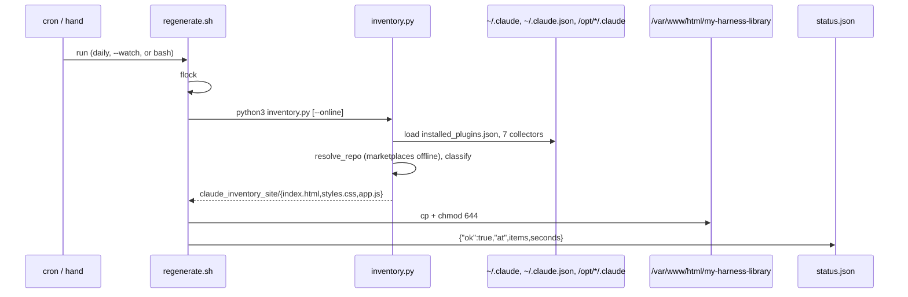
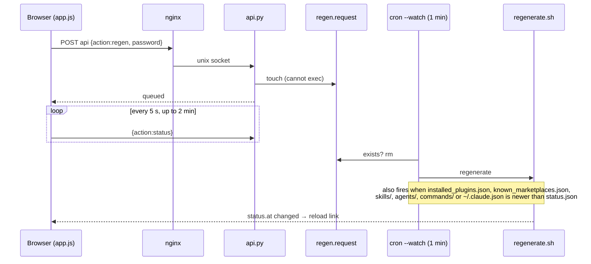
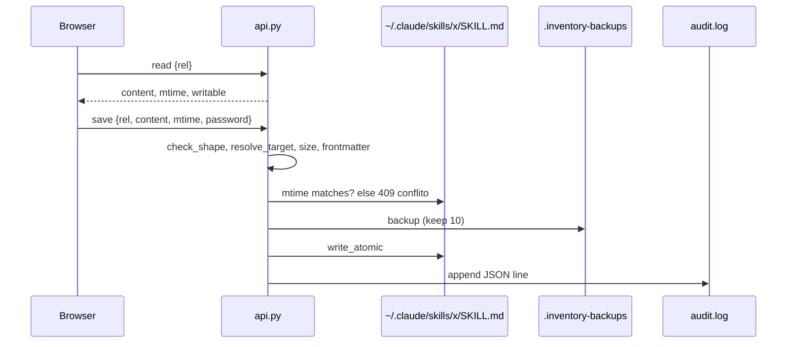

# Codebase Map

> Auto-generated by Cartographer. Last mapped: 2026-08-30T11:55:03Z (v1.1.0)

My Harness Library is a self-hosted, offline-first inventory and editor for a Claude Code installation. Three cooperating pieces, all Python stdlib and bash — no packages, no build step:

1. **`src/inventory.py`** — static-site generator (scanner + HTML/CSS/JS emitter).
2. **`src/api.py`** — the only dynamic part: JSON over a Unix socket, for editing the user's own skills/agents/commands. Password-protected, heavily sandboxed by systemd.
3. **`src/regenerate.sh`** — glue: runs the generator, publishes to the web root, records status; driven by cron.

Supporting: `setup.sh` (idempotent installer / `--check` diagnostics), `uninstall.sh`, `install.sh` (curl bootstrap), `harness-library.service.in` (systemd template), CI, README (effectively the spec).

## System Overview

```mermaid
graph TB
    subgraph Sources["~/.claude and friends (read-only for the generator)"]
        SK[skills/ agents/ commands/]
        PL[plugins/ + installed_plugins.json + known_marketplaces.json]
        CJ[~/.claude.json  MCPs]
        PR[/opt/*/.claude  project resources/]
    end
    subgraph Cron["cron (user)"]
        D[daily 06:22]
        W[every minute --watch]
    end
    subgraph Gen["Generator"]
        R[regenerate.sh]
        I[inventory.py]
    end
    subgraph Web["nginx"]
        S[/var/www/html/my-harness-library\nindex.html styles.css app.js/]
        P[location = /my-harness-library/api\nproxy_pass unix socket]
    end
    subgraph Backend["systemd: harness-library.service"]
        A[api.py\nAF_UNIX only, no exec]
    end
    subgraph State["~/.claude/.inventory"]
        ST[status.json]
        RQ[regen.request]
        AH[auth.hash  audit.log]
        RH[repo-health.json  update.json]
    end
    D --> R
    W --> R
    R --> I
    SK --> I
    PL --> I
    CJ --> I
    PR --> I
    I --> S
    R --> ST
    S -- "browser JS" --> P --> A
    A -- read/save/create/restore --> SK
    A -- regen --> RQ
    RQ -. consumed by .-> W
    SK -. mtime newer than status.json .-> W
    PL -. mtime .-> W
    CJ -. mtime .-> W
    A --> AH
    I --> RH
```

## Directory Structure

```
my-Harness-Library/
├── install.sh                      curl | sudo bash bootstrap → downloads tarball → setup.sh
├── VERSION                         single line, e.g. 1.1.0; compared against GitHub copy
├── README.md                       user-facing spec (install, security model, troubleshooting)
├── src/
│   ├── inventory.py                scanner + site generator (~3200 lines)
│   ├── api.py                      JSON backend over Unix socket (~520 lines)
│   ├── regenerate.sh               generate + publish + status; --watch mode for cron
│   ├── setup.sh                    idempotent installer; --check = read-only diagnostics
│   ├── uninstall.sh                reverse of setup; --purge removes state
│   └── harness-library.service.in  systemd unit template (@USER@ @HOME@ @PREFIX@)
├── docs/
│   ├── CODEBASE_MAP.md             this file
│   └── screenshot-{light,dark}.png
└── .github/workflows/ci.yml        lint + backend smoke test + generator run + secret scan
```

Runtime layout on the server (not in the repo):

| Path | Role |
|---|---|
| `/opt/harness-library/` | installed copy of `src/*` + `VERSION` — **what actually runs** |
| `/var/www/html/my-harness-library/` | generated site (recreatable) |
| `~/.cache/harness-library/` | generator scratch dir + `last-run.log` + flock |
| `~/.claude/.inventory/` | `auth.hash`, `audit.log`, `status.json`, `regen.request`, `repo-health.json`, `update.json` |
| `~/.claude/**/.inventory-backups/` | revisions of edited files (10 kept) |
| `/run/harness-library/sock` | Unix socket between nginx and `api.py` |

## Module Guide

### `src/inventory.py` — scanner and generator

**Purpose**: scan the harness, resolve provenance, classify, emit 3 static files.
**Entry point**: `main()` (line ~3174). CLI: `python3 inventory.py [path] [--online]`. Output goes to `./claude_inventory_site/` in the cwd.

| Section | Key symbols | Role |
|---|---|---|
| Config (66–74) | `BASE`, `CLAUDE_JSON`, `OUT_DIR`, `CACHE_FILE`, `GITHUB_TOKEN`, `ONLINE` | positional arg overrides `~/.claude`; `--online` enables network |
| Repo detection (118–290) | `normalize_github_url`, `repo_from_git_config` (a), `repo_from_marketplace` (b2), `repo_from_npm` (c), `repo_from_github_search` (d), `resolve_repo` | layered cascade; (b2) reads `known_marketplaces.json` and resolves nearly everything offline; (c)(d) online only, cached, (d) marks `repo_guess` |
| Frontmatter (292–345) | `parse_frontmatter`, `first_paragraph` | minimal YAML parser, supports `>`/`|` blocks |
| Collectors (346–765) | `collect_skills`, `collect_agents`, `collect_commands`, `collect_plugins`, `collect_plugin_resources`, `collect_project_resources`, `collect_mcps` | see scope rules below |
| Scope helpers (508–620) | `PROJECT_ROOTS`, `load_installed_plugins`, `installed_owner`, `plugin_owner`, `md_item`, `collect_from_claude_dir` | `installed_plugins.json` is the single source of truth for "installed" |
| Categorisation (766–890) | `CATEGORY_LABEL`, `CATEGORY_EN`, `CATEGORY_MAP`, `CATEGORY_RULES`, `classify` | precedence: frontmatter `category:` > exact map > family prefix (`caveman-compress` → `caveman`) > regex rules > `outros` |
| Repo health (890–990) | `refresh_repo_health`, `health_badge`, cache at `~/.claude/.inventory/repo-health.json` | one GitHub request per distinct repo (~8), online only; offline shows cached |
| Update check (991–1057) | `VERSION_URL`, `local_version`, `semver`, `check_update` → `update.json` | online only; never blocks generation |
| Host identity (1058–1100) | `host_ip` (UDP-connect trick, avoids Docker bridge IPs), `host_user` | provenance block on the page |
| i18n (1101–1128) | `bi`, `bit` | emits `data-pt`/`data-en` attribute pairs; client JS swaps |
| `build_site` (1129–3170) | index.html, styles.css, **app.js as a raw Python string** | cards, chips, editor modal, history/diff, new-resource dialog, regenerate dialog (polls `status` every 5 s for 2 min), password dialog, update banner |

**Scope rules** (how a resource is labelled):

| Scope | Rule |
|---|---|
| `meu` (Mine) | directly under `~/.claude/{skills,agents,commands}`; the only editable ones |
| `instalado` (Installed) | path under an `installPath` listed in `installed_plugins.json` |
| `disponivel` (Available) | under `plugins/marketplaces/**` but not installed |
| `projeto` (From project) | under `PROJECT_ROOTS` = `/opt/*/.claude` (hard-coded; `/opt/helpdesk` excluded) |

Same `(kind, name, plugin)` both installed and in a catalogue → installed wins. Stale `plugins/cache` copies not in `marketplaces/` and not installed are dropped.

**Dependencies**: stdlib only (`urllib`, `json`, `re`, `pathlib`, `pwd`, `socket`).
**Dependents**: `regenerate.sh`, CI.

### `src/api.py` — backend

**Purpose**: read/write the user's own `.md` resources with password, revisions, audit log. Structurally cannot run commands.
**Entry point**: `Server(ThreadingUnixStreamServer)` on `HARNESS_SOCKET` (default `/run/harness-library/sock`), socket `chmod 0660` so group `www-data` (nginx) can connect. `do_GET` → 405; everything is `POST {"action": ...}`.

| Action | Auth | What it does |
|---|---|---|
| `read`, `history`, `revision` | no | content + mtime + writable flag; list revisions; one revision |
| `save` | yes | size ≤ 1 MiB, writable, **mtime conflict check (409)**, frontmatter valid → backup → atomic write → audit |
| `create` | yes | slug/path shape, must not exist, frontmatter → mkdir → atomic write → audit |
| `restore` | yes | revision → validate → backup current → write → audit |
| `status` | no | `status.json` + `pending` (does `regen.request` exist) |
| `regen` | yes | writes `regen.request` — that is all; cron does the work |
| `passwd` | current pw | rewrites `auth.hash` atomically |

Security pieces: `ALLOWED_ROOTS = (skills, agents, commands)`; `check_shape` rejects null bytes, absolute, `..`, non-`.md`; `resolve_target` resolves symlinks then re-checks `is_relative_to(root)`. Password `scrypt$N$r$p$salt$key`, `hmac.compare_digest`, 0.4 s sleep + audit on failure. `validate_frontmatter` requires `name:` and `description:` for skills/agents (Claude Code silently ignores resources without them); commands exempt. `KEEP_REVISIONS = 10`, `MAX_BYTES = 1 MiB`. Audit line: ts, action, file, bytes, `X-Real-IP` (trusted from nginx), UA.

**Dependencies**: stdlib. **Dependents**: nginx `location = /my-harness-library/api`, the page's `app.js`, CI smoke test.

### `src/regenerate.sh` — pipeline

Vars: `WORK=~/.cache/harness-library`, `DEST=/var/www/html/my-harness-library`, `STATE=~/.claude/.inventory`, `STATUS`, `REQUEST`, `LOCK`.

1. `--watch` (the 1-minute cron): act if `regen.request` exists (consume it) **or** `harness_changed()` — any of `WATCHED` newer than `status.json` (`find -maxdepth 2 -newer`). Otherwise exit 0.
2. `flock -n` on `$LOCK` — concurrent run skips.
3. `python3 inventory.py "$@"` from `$WORK`, log to `last-run.log`; failure → `{"ok":false}` in `status.json`, exit 1.
4. Copy 3 files to `DEST`, `chmod 644`, count `<article class="card`, write `{"ok":true,"at","items","seconds"}`.

`WATCHED` = `plugins/installed_plugins.json`, `plugins/known_marketplaces.json`, `skills/`, `agents/`, `commands/`, `~/.claude.json`. `status.json` is rewritten after every run (ok or fail) → a broken generation cannot loop.

### `src/setup.sh` — installer

Dynamic target discovery: `TARGET_USER=${SUDO_USER:-$(id -un)}`, home via `getent`. Steps: dependency check (python3 ≥ 3.9, nginx, curl, flock, crontab, systemctl; apt-installs if missing) → diagnose current state → **`--check` stops here, no sudo** → render unit template to `/etc/systemd/system/harness-library.service` → `pick_vhost()` finds the `sites-enabled` vhost with `root /var/www/html;` (prefers `listen 443`), backs it up, injects the `location = /my-harness-library/api` block via awk → create webroot (owner user, group www-data, 2775) and state dir (700) → password from `HARNESS_PASSWORD` / TTY prompt / default `change-me-now` (with loud warning; the `curl | sudo bash` path) → install the two cron lines → `systemctl enable --now` → `nginx -t && reload` → first generation as the user → HTTP(S) probe of page and `{"action":"status"}`.

### `src/uninstall.sh`

Removes cron lines (targeted `grep -v`, not a wipe), unit, nginx block (awk state machine on a **single fresh backup** — a past bug concatenated multiple `*.bak-*` backups), webroot. `--purge` also removes `~/.claude/.inventory` and all `.inventory-backups`. Never touches skills/agents/commands.

### `src/harness-library.service.in`

`User=@USER@ Group=www-data UMask=0077`, `RuntimeDirectory=harness-library`, `ProtectSystem=strict`, `ProtectHome=read-only`, **`ReadWritePaths=@HOME@/.claude` (the only writable hole)**, `NoNewPrivileges`, empty capability sets, `RestrictAddressFamilies=AF_UNIX`, `SystemCallFilter=@system-service` minus `@privileged @resources @obsolete @mount @debug @swap` (denies process spawning), `MemoryDenyWriteExecute`, `MemoryMax=128M`, `TasksMax=16`.

### `install.sh`

`REPO=Epaminondaslage/my-Harness-Library`, `HARNESS_REF` (default `main`), `HARNESS_PREFIX` (default `/opt/harness-library`). Downloads tarball from codeload, copies `src/*` + `VERSION` into prefix, `chmod +x`, execs `setup.sh` preserving `SUDO_USER` and `HARNESS_PASSWORD`.

### `.github/workflows/ci.yml`

`bash -n` on the 4 scripts → backend smoke test in a sandbox HOME (`read` of a demo skill returns `name: demo`; `plugins/x/SKILL.md` returns code `escopo`) → `py_compile` → render unit and `systemd-analyze verify` (non-fatal) + grep `ProtectSystem=strict`/`NoNewPrivileges=yes` → run generator on a fake `.claude`, `node --check` the emitted `app.js` → secret scan (`ghp_`, `gho_`, `sk-`, bcrypt).

## Data Flow

### Generation



### Regeneration from the page, and automatic on harness change



### Editing a skill from the page



Only `meu` cards (with `data-rel`) open the editor; plugin/project cards are plain. New resources are created server-side only on first Save (`isNew`).

### Install / update / uninstall

`curl install.sh | sudo bash` → tarball → `/opt/harness-library` → `setup.sh` (idempotent). Update = same one-liner; **no auto-update by design** (supply-chain reasoning in README; opt-in weekly root cron snippet there). `uninstall.sh [--purge]` reverses.

## Conventions

- **Stdlib only.** No pip, no npm, no build. `app.js` and `styles.css` live inside `inventory.py` as raw strings.
- **Offline first.** Everything works without network; `--online` adds npm/GitHub lookups, cached in `~/.claude/.inventory/`.
- **State only under `~/.claude/`.** The systemd sandbox sees nothing else writable; `/var/www` is written by cron as the user, not by the backend.
- **Request-file pattern.** Backend never executes; it leaves files for cron.
- **Atomic writes** everywhere (`os.replace`, temp + `mv`).
- **Bilingual via attributes** (`data-pt`/`data-en`), client-side swap; `MSG` dict in `app.js` for runtime strings.
- **Theme**: `prefers-color-scheme` default, `data-theme` override persisted in `localStorage` (`inv-theme`).
- Comments and UI strings in Portuguese; commit messages, README and code identifiers mostly English.

## Gotchas

- **`/opt` is root's.** Editing the checkout does nothing until `install.sh | sudo bash` or `sudo cp` — and copying directly makes `/opt` diverge from git. Always commit + push first.
- **Regenerate takes up to 60 s** by design (cron latency). The "Regenerate" button just touches a file.
- **Read actions need no password.** Anyone reaching the API can `read`/`history`/`revision` `meu` resources; only writes are gated.
- **`~/.claude.json` is noisy** — Claude Code writes UI state there, so `--watch` fires extra runs (~1 s each). Remove it from `WATCHED` if unwanted.
- **`PROJECT_ROOTS` is computed at import time** and hard-codes `/opt/*/.claude` minus `/opt/helpdesk`. Project resources are **not** watched for auto-regen.
- **"Installed wins" dedup appears twice** (`collect_plugins`, `collect_plugin_resources`) with slightly different keys — change both.
- **`grep -r` does not follow symlinks**; `sites-enabled` is symlinks → scripts use `-R`.
- **Never feed awk a `*.bak-*` glob** — uninstall bug history; use the single fresh backup.
- **`app.js` is a Python raw string** — backslashes fine, but a `"""` inside would break it; `node --check` in CI catches syntax.
- Password hash lives in a data file (`auth.hash`), never in code (an earlier PHP-era `require` was served stale by opcache).
- `check_password` sleeps 0.4 s on failure; no real rate limiting beyond that — rely on the LAN.
- Category example counts in README (248, 52/183, 244/248) are illustrative, not thresholds.

## Navigation Guide

| To… | Touch |
|---|---|
| Add a source directory to scan | `PROJECT_ROOTS` or a new `collect_*` in `inventory.py`; call it in `main()`; consider adding the path to `WATCHED` in `regenerate.sh` |
| Change what triggers auto-regeneration | `WATCHED` array in `src/regenerate.sh` |
| Add/adjust a category | `CATEGORY_LABEL`, `CATEGORY_EN`, `CATEGORY_MAP`, `CATEGORY_RULES` in `inventory.py` |
| Change page UI / behaviour | `build_site()` in `inventory.py` — HTML, CSS and the `app.js` raw string; add `data-pt`/`data-en` for any new text and a `MSG` entry for runtime strings |
| Add an API action | `act_<name>` in `api.py`, register in `ACTIONS`; decide auth; add audit; add a CI smoke check in `ci.yml` |
| Change sandbox / socket path | `harness-library.service.in` (`HARNESS_SOCKET`, `ReadWritePaths`, syscall filter); nginx block in `setup.sh` `pick_vhost()` |
| Change revisions kept / max size | `KEEP_REVISIONS`, `MAX_BYTES` in `api.py` |
| Release | bump `VERSION`, commit `chore: release X.Y.Z`, tag `vX.Y.Z`, `gh release create`; server updates via `install.sh` |
| Debug a failed generation | `~/.cache/harness-library/last-run.log`, `~/.claude/.inventory/status.json`, `~/logs/harness-library.log` |
| Debug the backend | `systemctl status harness-library`, `journalctl -u harness-library`, `bash setup.sh --check` |
